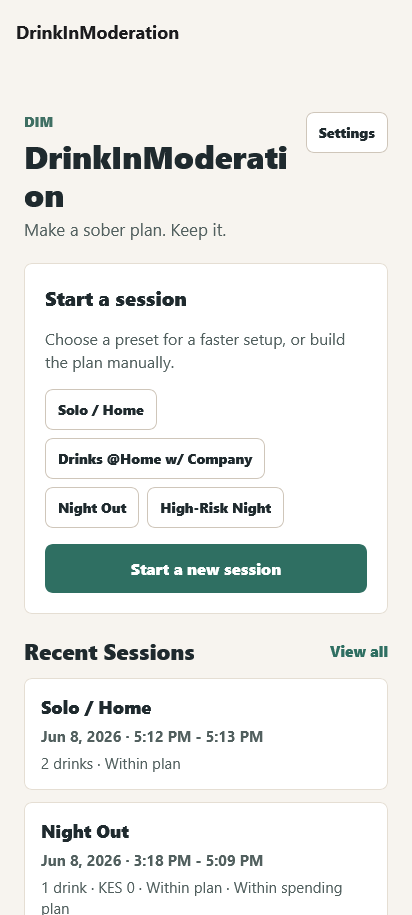
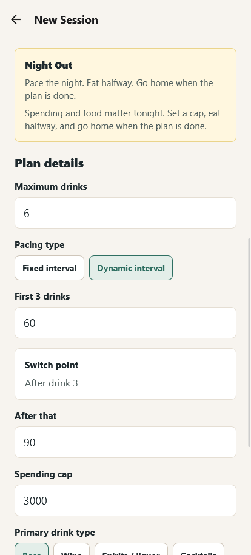
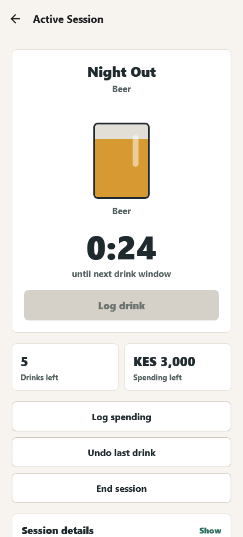
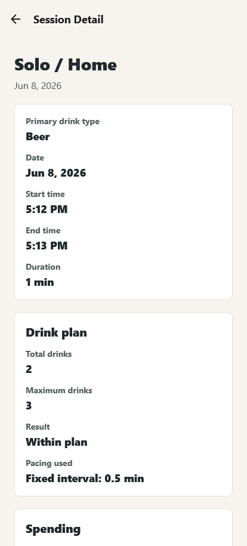
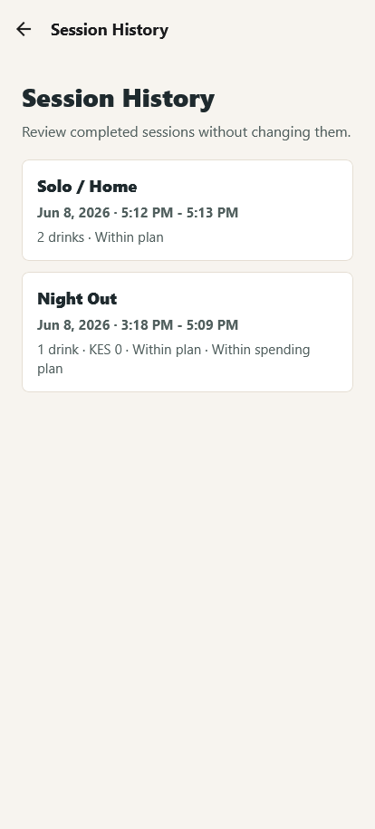
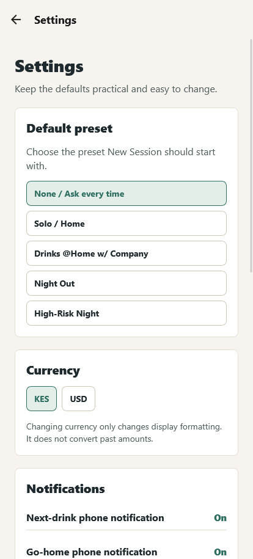

# One More Drink

**Make a sober plan. Stick to it.**

One More Drink, or OMD, is a React Native Expo mobile app for alcohol harm reduction. The name is intentionally cheeky, but the purpose is serious: help a user make a clear sober plan before drinking, then keep pacing, spending, and session guardrails visible once the session starts.

OMD is not designed to encourage drinking. It is a sober pre-commitment and pacing assistant that helps users pause before the next drink, respect their limits, track spending, and end the session with fewer regrets.

## Problem Statement

Manual phone timers are clunky during social drinking, and relying on judgment after a few drinks is unreliable. OMD helps users set a plan before drinking, then keeps timing, spending, and session guardrails visible.

## Why I Built This

I built OMD to turn a simple harm-reduction strategy into a practical mobile product: make the important decisions while sober, then use the app to keep pacing, limits, and spending visible during the session. The project also gave me a focused way to learn a Codex-first development workflow while building something grounded in a real user need.

## Core Concept

The user makes the plan while sober. OMD helps protect that plan later by making the next decision easier:

- How many drinks are left?
- Is the next drink window open?
- Is spending still within the plan?
- Is this a good time to slow down, eat, drink water, or go home?

The tone is calm, practical, direct, and non-judgmental.

## Screenshots

| Home | New Session | Active Session |
| --- | --- | --- |
|  |  |  |

| Session Summary | Session History | Settings |
| --- | --- | --- |
|  |  |  |

## Features

- First-run onboarding with the core OMD concept
- Quick-start session presets:
  - Solo / Home
  - Hosting Company
  - Night Out
  - High-Risk Night
- Fixed and dynamic pacing intervals
- Primary drink type selection
- Visual drink countdown and large active-session timer
- Drink logging with max drink guardrails
- Undo last drink
- Local next-drink reminders
- Food and go-home reminders
- Spending cap tracking
- Spending entries with categories and notes
- Generosity guardrail for rounds / buying for others
- Edit and delete active-session spending entries
- Session summary after ending a session
- Recent sessions on Home
- Full session history and completed-session detail views
- Delete completed sessions
- Settings for default preset, currency, notifications, onboarding, and local data management
- Local-first persistence and privacy

## Tech Stack

- React Native
- Expo SDK 54
- Expo Router
- TypeScript
- EAS Build
- AsyncStorage for local persistence
- expo-notifications for local reminders
- React Context for session and settings state

## Architecture Overview

- `app/`: Expo Router screens and route structure.
- `context/session.tsx`: in-memory active session state, completed session history, persistence, and session actions.
- `context/settings.tsx`: persisted local app settings.
- `utils/session-notifications.ts`: local notification permission, scheduling, reconciliation, and cancellation helpers.
- `utils/currency.ts`: KES / USD display formatting.
- `utils/pacing.ts`: fixed and dynamic interval rules.
- `utils/session-format.ts`: date, time, duration, and compact session summary formatting.
- `components/DrinkProgressVisual.tsx`: reusable visual drink countdown component.

The app is intentionally local-first for the MVP. There is no backend, account system, cloud sync, or analytics.

## Getting Started

Install dependencies:

```powershell
npm install
```

Start the app for a development build:

```powershell
npx expo start --dev-client
```

Expo Go may not be sufficient for all testing because OMD uses native notification behavior and has a custom development build setup.

## Running Locally

Start for web testing:

```powershell
npx expo start --web
```

Start for a development build on the local network:

```powershell
npx expo start --dev-client --lan
```

If you need to pin the Metro port:

```powershell
npx expo start --dev-client --lan --port 8081
```

## Android Development Build

Create an Android development client build:

```powershell
npx eas-cli@latest build --platform android --profile development
```

After installing the development build on the phone, start Metro:

```powershell
npx expo start --dev-client
```

Open the installed OMD development build and connect to the Metro URL shown in the terminal.

## Preview APK Build

Create an Android preview APK for direct installation:

```powershell
npx eas-cli@latest build --platform android --profile preview
```

The preview profile is configured for APK output in `eas.json`.

## Privacy

OMD stores session data locally on the device. The MVP does not use accounts, cloud sync, analytics, or a backend.

## Harm-Reduction Disclaimer

One More Drink is a planning and harm-reduction tool, not medical advice. If alcohol is causing repeated harm or feels difficult to control, consider speaking with a qualified professional.

## Roadmap

- Better visual drink animations
- Optional custom notification sounds
- Export session data
- Richer session insights
- Safety / exit tools
- Improved automated testing
- iOS build testing

## Known Limitations

- Android-focused testing so far
- No cloud sync
- No account system
- No medical guidance
- Notification behavior can vary by platform and device settings
- Custom notification sounds are not implemented yet
- Currency settings change display formatting only and do not convert stored values

## License

License placeholder. A final license has not been selected yet.
